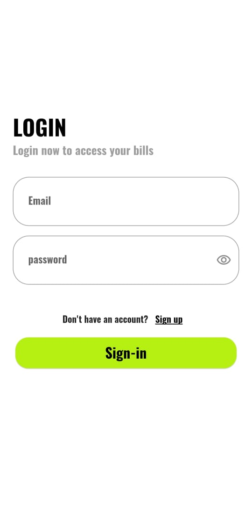
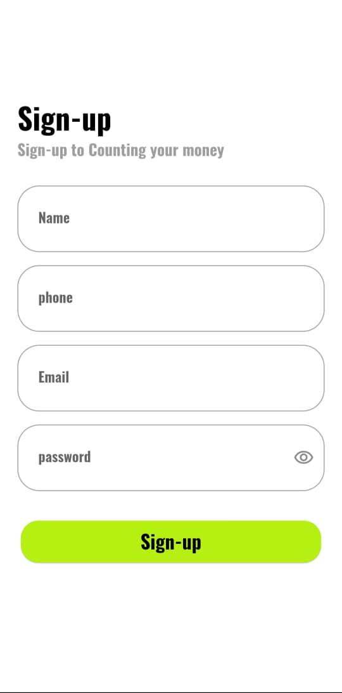
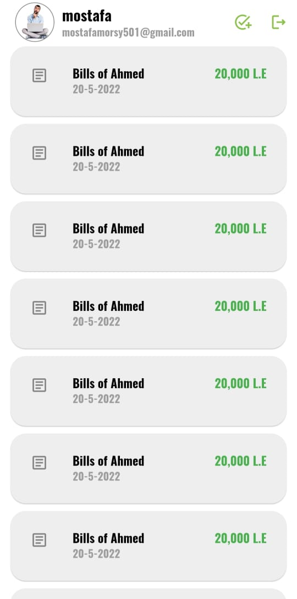
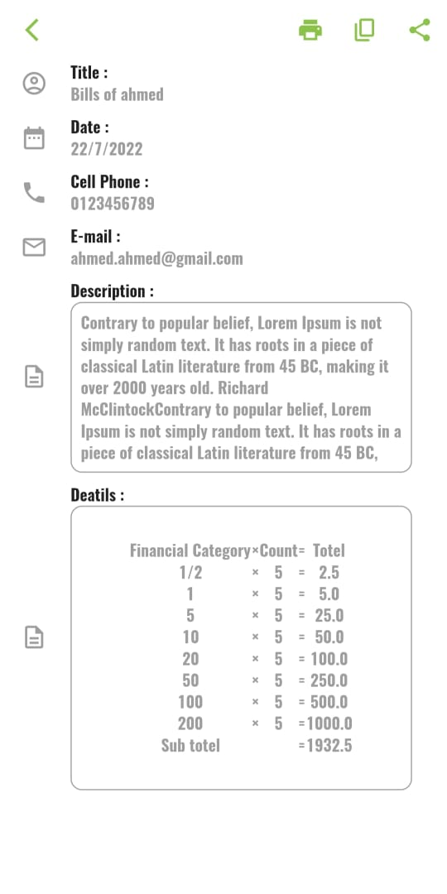
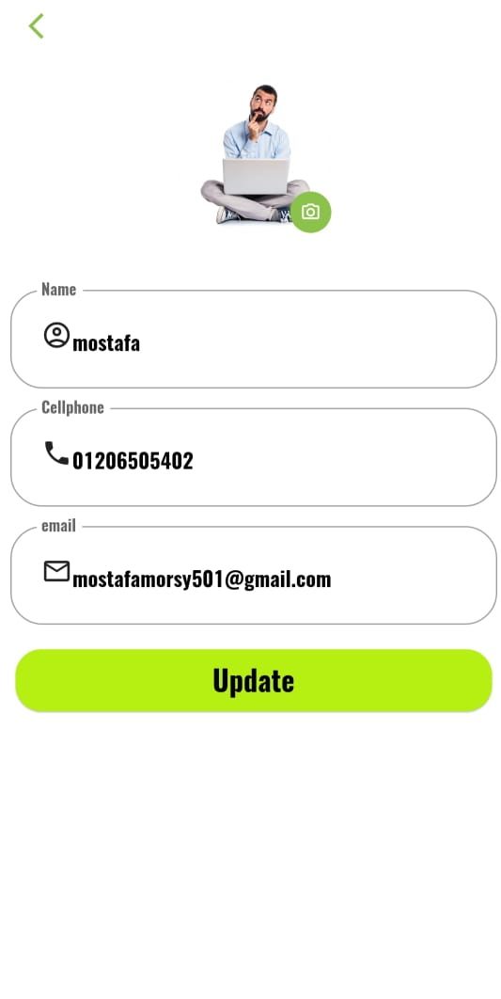
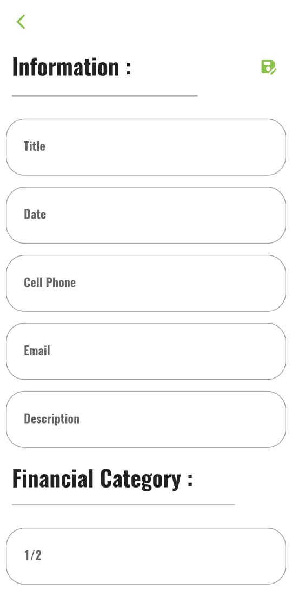
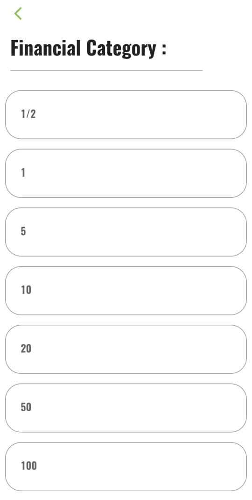
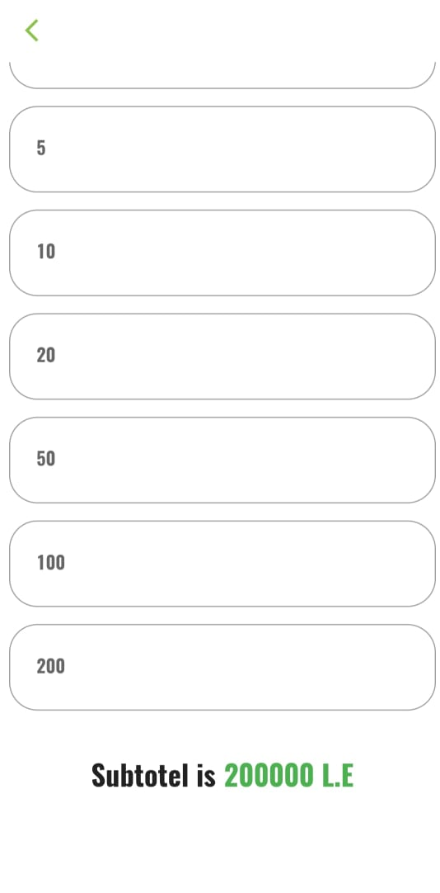

# Count money App

## Introduction:

    Let me give you a brief overview of the project, 
    Contain an Auth methode (Login - Signup)  also profile screen to edit the user profile.
    there is anther 4 screen:History of user process,
    and as a second screen is a deatils of user process ,
    also The ADD new process  Screen to can add new process,
    Finally, The setting screen for edit your data.

## This Project Created use :
        - Sign-In, Sign-Up and Log_out using Email & Password by Firebase .
        - Edit your account information and upload image at Profile section.
        - Using Responsive UI.
        - Using Firebase , Sheard prefrence.
        - Using Cubit as state management.
        - Using MVC as Architect Design.

## ScreenShots

